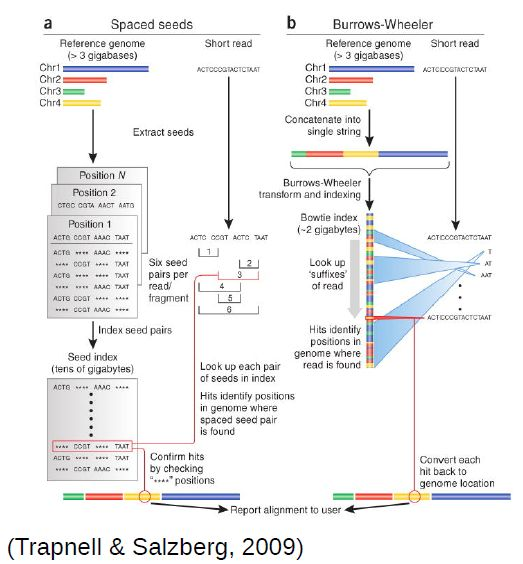

### <a id="LO1">Learning Outcome 1: Plan your experiment using NGS technologies</a>

A good source of information for this part is [RNA-seqlopedia](http://rnaseq.uoregon.edu).

#### Obtaining your RNA

The first step in a transcriptomic experiment is to obtain the RNA. After isolating total RNA from cells, one can directly sequence it. Nonetheless, the majority of the RNA in a cell is ribosomal RNA, which may need to be removed using specific kits. Moreover, total RNA also contains unprocessed immature transcripts and RNA targeted for degradation (at different stages of processing). 

Therefore, unless one is interested in non-coding RNAs or other aspects related to transcription, it is usually better to apply protocols that extract the mature mRNAs (usually through the PolyA tails). Since most people are interested in coding-genes, it is more common to use mRNA-specific protocols. 

Some protocols can also keep strand information. In this case, the reads have the same (or the reverse) strand as the transcribed RNA. This is particularly relevant when sequencing total RNA, noticeably to distinguish real transcripts from transcriptional activity resulting from stalled promoters or enhancers. It can also be useful to distinguish between overlapping genes.
 
Finally, we also need to consider the amount of material available. Are we dealing with samples with a lot of RNA (eg. cell cultures), or short amounts (eg. small tissue samples, single-cell) that are prone to amplification artifacts and presence of contaminant sequences? 

All these aspects need to be taken into consideration both when selecting a sequencing protocol as well as when analyzing the data.

#### Options for sequencing

At the moment, the sequencing technology most often used (by far) is Illumina. The following links are a good source of information regarding this sequencing technology:
* [Illumina Sequencing by Synthesis](https://www.youtube.com/watch?&v=fCd6B5HRaZ8).
* [Elaine Mardis talk on NGS](https://www.youtube.com/watch?v=v1DbcJD4Ry0).

Main options to be considered when sequencing:
* Single versus Paired-end
* Read Length
* Coverage (number of reads)

For the analysis of differential gene expression, long reads, paired-end, and stranded library preparation methods are not as important, particularly if a reference genome is available. Focus should be given on replicates in order to obtain accurate measures of variances. The number of replicates and depth of sequencing depends on the experiment. For highly controlled conditions (such as cell cultures), 2-3 replicates could be enough. In terms of coverage, 10-40M reads should be enough to capture most "reasonably" expressed genes, although in single-cell experiments less reads may be sufficient (5-10M). Nonetheless, to be able to more accurately estimate how much is needed, one should always generate [small pilot datasets](http://scotty.genetics.utah.edu/scotty.php). 

For this course, we will focus on the analysis of differential gene expression between two conditions. Thus, we assume unstranded mRNA-specific library preparation methods, sequenced using illumina (NextSeq, HiSeq) short (less than 100bp) single-end reads. We also assume 2-3 replicates per condition, sequenced to a medium throughput (10-40M reads). We will nonetheless briefly discuss what to do in other cases such as longer reads, paired data, stranded data, and more complex differential expression conditions. 

### <a id="LO2">Learning Outcome 2: List steps in the analysis of RNA-Seq differential expression experiments</a>

Steps in the analysis of RNA-Seq:
* QC of Raw Data; ([Learning Outcome 3](#LO3))
* Preprocessing of Raw Data (if needed); ([Learning Outcome 4](#LO4)) 
* Alignment of "clean" reads to reference genome ([Learning Outcome 5](#LO5))
* QC of Aligments ([Learning Outcome 6](#LO6))
* Generate table of counts of genes/transcripts ([Learning Outcome 7](#LO7))
* Differential Analysis tests ([Learning Outcome 8](#LO8))
* Post-analysis: Functional Enrichment ([Learning Outcome 9](#LO9))

# <a id="LO3">Learning Outcome 3: Assess the general quality of the raw data from the sequencing facility</a>

## <a id="LO3.1">LO 3.1 - Interpret what are fastq files and what is their content</a>

Most high-throughput sequencing (HTS) machines output [fastq files](https://en.wikipedia.org/wiki/FASTQ_format), the “de facto” current standard in HTS. Fastq files are simply text files, where each block of information (a sequenced DNA fragment, or read) in this format is encoded as 4 lines:

	@read_identifier
	read_sequence
	+ separator line
	base_qualities

Each base has a quality character associated with it, representing how confidently the machine identified (called) the base. The probability of error per base is given as a [Phred score](https://en.wikipedia.org/wiki/Phred_quality_score), calculated from an integer value (Q) derived from the quality character associated to the base. Useful reference values of Q include:
* Q=10 - 90% accuracy
* Q=20 - 99% accuracy
* Q=30 - 99.9% accuracy
* Q=40 - 99.99% accuracy

Although there's theoretically no limit, Q usually goes up to around 40 in recent illumina machines.

You can see a few fastq files in the folder fastq_examples:
* sample_quality_and_adaptors.fastq.gz
* sample_adaptors.fastq.gz
* 20150821.A-2_BGVR_P218_R1.sample.fastq.gz
* 20150821.A-2_BGVR_P218_R2.sample.fastq.gz

Since each fastq can have several million reads, they can become very big. Therefore, it is usual to keep them in a compressed format such as gzip. Most recent software dealing with NGS data can directly read compressed fastq files.

**TASK**: In Firefox, click on the Galaxy bookmark to access your local Galaxy. Upload all sample files into Galaxy by clicking on the upload icon  on the topleft, or by selecting the "Upload File" tool from the "Get Data" section in the tools menu.

**Hint**: When uploading, Galaxy will try to guess the type of your files, but you can also explicitly specify the type of the files when uploading. For the files in fastq_examples, you can specify that they are of the type 'fastqsanger.gz'.

You probably noticed that two of the example files have the same name, except for R1 and R2. This is an example of a paired-end dataset. If you inspect both datasets (by clicking on the eye button ), you can find the same identifiers in each of the files, in the same order. In R1 you have the forward reading of a fragment, and in R2 you have the reverse reading of the same fragment.

## <a id="LO3.2">LO 3.2 - Use software like FastQC to process fastq files and produce QC reports</a>

High Throughput Sequencing machines read thousands, or even millions of sequences in parallel. As you can imagine, this usually generates large fastq files, with millions of lines. Manually inspecting quality of each read is out of question. Thus, specialized software has been developed to provide quality measures for fastq files generated by HTS machines. [FastQC](https://www.bioinformatics.babraham.ac.uk/projects/fastqc/) is a popular program to generate quality reports on fastq data. Running FastQC on your raw data is usually the first thing you should do once you receive a new dataset.

**TASK**: In Galaxy, run FastQC in each of the example files (you may search for fastqc in the search tools section).

**Hint**: You can run the same tools on multiple datasets by selecting batch mode .

## <a id="LO3.3">LO 3.3 - Read QC reports of raw data to assess the general quality of data and presence of sequence bias</a>

FastQC reports provide a series of plots that allow the user to assess the overall quality of their raw data and detect potential biases and problems. 

Some plots indicate distribution of base qualities along the length of reads. You can notice that, at least for illumina data, on average the quality of each base tends to decrease along the length of the read. You can also see that the reverse read (R2) is usually of worse quality than the forward read (R1). Therefore, short single-end reads usually have better average quality, and are often ready to use right out of the sequencer.

 

Other plots indicate biases in nucleotidic content of reads, either globally (as %GC plots), or positionally. Global bias in nucleotidic content can be useful to search for signs of contaminants. On the other hand, positional bias are useful to detect presence of artefactual sequences in your reads such as adaptors. Another insight you may obtain from this information are potential biases in the preparation of your library. For example, random hexamer priming is actually not truly random, and preferentially selects certain sequences. The currently popular transposase-based enzymatic protocol, although reasonably random, is also not completely random, and you can see this through positional bias, particularly in the beginning of reads. The presence of adaptors is a relatively common event, and therefore specific plots exist to detect the presence of the most commonly used adaptors. Finally, the presence of repetitive sequences can also suggest contaminants, PCR artifacts, or other types of bias.

 

**TASK**: Inspect the FastQC Reports generated previously and detect potential issues.

**Question**: What is the main issue in sample_adaptors? 

**Question**: What is the main issue in sample_quality_and_adaptors? 

**Question**: What is the main difference between R1 and R2 of the paired 20150821.A-2_BGVR_P218 sample?

**TASK**: Open a command line terminal. Type 'fastqc' to obtain the FastQC visual interface. Run FastQC in the example files using the visual interface.

**TASK**: Open a command line terminal. Using the 'cd' command, go to the 'fastq_examples' folder. Type 'fastqc *.fastq.gz'. Look inside the folder. What results did you get?

**TASK**: (optional) If you have your own data, use FastQC (in Galaxy or with the command line) to inspect your data.

# <a id="LO4">Learning Outcome 4: Do simple processing operations in the raw data to improve its quality</a>

In most cases, particularly if you're sequencing short, single-end reads, the quality of your raw data is good enough to continue without any preprocessing. In fact, if you send your sequencing to an external facility, they often do these verifications and filtering for you, and you have “clean” sequences in the end. Nonetheless, it is always better to check before proceeding. 

Sometimes things can go wrong, and you may need to do something about it. Some types of problems, like presence of contaminants, or some instances of positional bias will require to go back and redo the experiments. Other issues can be minimized. 

## <a id="LO4.1">LO 4.1 - Use tools such as seqtk and trimmomatic to remove low quality bases from your reads</a>

As you may have noticed before, reads tend to lose quality towards their end, where there is a higher probability of erroneous bases being called. To avoid problems in subsequent analysis, you should remove regions of poor quality in your read, usually by trimming them from the end of reads using tools such as [seqtk](https://github.com/lh3/seqtk). 

**Question**: Even if all bases that your machine reads have a Q=20 (1% error rate), what is the probability that one 100bp read is completely correct? To answer this, consider for the sake of this example that all bases are read independently.

**TASK**: In Galaxy, use seqtk trimfq with sample_quality_and_adaptors using 0.05 as an error threshold. Then use FastQC to evaluate the impact of the procedure. Compare the result you obtain with seqtk versus a simpler approach of cutting your reads to a fixed length.

**TASK**: In Galaxy, use seqtk trimfq with sample_quality_and_adaptors using 0.01 as an error threshold. Then use FastQC to evaluate the impact of the procedure. Compare the result with using 0.05 as an error threshold.

Another popular tool to filter fastq files is [Trimmomatic](http://www.usadellab.org/cms/?page=trimmomatic). This tool implements more elaborate trimming strategies, such as average window threshold.

**TASK**: In Galaxy, use Trimmomatic to remove low quality bases from sample_quality_and_adaptors. Notice that the default method in Trimmomatic is a 4bp window average, with a threshold of Q=20. Finally, look at the impact using FastQC of trimmed reads. NOTE: Trimmomatic requires you to specify that you use the "standard" Phred Q scale (fastqsanger), which was different from the one used in older datasets (before 2012), so you need to manually change the datatype of your dataset from generic fastq to fastqsanger (for this, click the Edit Attributes button  of the fastq file, then click on the "Datatype" tab and select fastqsanger - NOT fastqcssanger).

## <a id="LO4.2">LO 4.2 - Use tools such as cutadapt to remove adaptors and other artefactual sequences from your reads</a>

Sequencing machines often require that you add specific sequences (adaptors) to your DNA so that it can be sequenced. Although sequencing facilities will generally remove these from the reads, for many different reasons, such sequences may end up in your reads, and you will need to remove them yourself. Moreover, cDNAs may contain parts of the non-genomic polyA tails that are part of mature mRNAs. Since these sequences are not part of the genome, they may prevent proper alignment and need to be removed before proceeding.

To remove these unwanted sequences, not only you have to look for the sequence in the reads, but also allow for sequencing errors, as well as the presence of incomplete sequences. Tools such as [cutadapt](http://cutadapt.readthedocs.io/en/stable/guide.html) do precisely this.

**TASK**: In Galaxy, use cutadapt to remove adaptors from sample_adaptors.fastq. In this sample, we know that we used the illumina adaptor GTGACTGGAGTTCAGACGTGTGCTCTTCCGATCT, so try to remove this from the 3' end of reads and see the impact of the procedure using FastQC. For this, you need to insert a new adapter in 3', and in the source, select "Enter a custom sequence" (you don't need to add a name, just paste the sequence). What happened? Almost no read was affected. This is because what you get is a readthrough, so you actually have the reverse complement of the adaptor (from the opposite strand). Now, try the same procedure but with AGATCGGAAGAGCACACGTCTGAACTCCAGTCAC (reverse complement of the previous). Much better, no?

One issue of removing the adaptors is that you need to know which ones were used in your data. FastQC can already tell you which one was used, and you can then go to the illumina manual to search for its sequence. Since Illumina is used most of the time, these adaptors are already integrated in tools like Trimmomatic, which also take in consideration issues like reverse complement. 

**TASK**: In Galaxy, Use Trimmomatic to remove adaptors from sample_adaptors.fastq.gz using Truseq3 adaptors (for this you need to select to perform an initial Illumina clip, then select the appropriate database of adaptors) and use FastQC to see the impact.

**TASK**: As you noticed, you can use Trimmommatic to do both quality and adaptor trimming. In Galaxy, use Trimmomatic to remove low quality bases from sample_quality_and_adaptors.fastq, as well as the remainings of illumina Nextera adaptors that are still left in some of the reads. Like before, you may need to change the type of file from fastq to fastqsanger.

Paired-end data need to be handled with special care. Some quality filtering software will remove reads entirely if their quality is very bad. This can result in pairing information being lost, if the other member of the pair is not also removed (or placed in a special set of unpaired sequences). Software such as Trimmomatic can also take paired data as input, and handle them properly.

**TASK**: Use Trimmomatic with the 20150821.A-2_BGVR_P218 paired-end example RNA-Seq data (use Truseq adaptors). Use FastQC to evaluate the impact of the procedure. If you use trimmomatic on each individual file, you'll lose the pairing information. Therefore, you need to provide the paired data to Trimmomatic. Notice that, beside a paired fastq file, you also obtain unpaired reads that lost their pair.

**Question**: Which one has more reads - unpaired R1, or unpaired R2? Why is that?

**TASK**: Open the commandline. Using the cd command, go to the fastq_examples folder. Run the following command: 'seqtq trimfq'. Look at the available options. Next, run the command: 'seqtk trimfq -q 0.01 sample_quality_and_adaptors.fastq.gz > sample_quality_and_adaptors.trimmed.fastq'. 

**TASK**: In the same commandline, run the following command: 'cutadapt --help'. Inspect the options. Next, run: 'cutadapt -a AGATCGGAAGAGCACACGTCTGAACTCCAGTCAC -o sample_adaptors.trimmed.fastq sample_adaptors.fastq.gz'.

**TASK**: Run the following command: 'TrimmomaticSE sample_quality_and_adaptors.fastq.gz sample_quality_and_adaptors.trimmed.v2.fastq SLIDINGWINDOW:4:20 ILLUMINACLIP:adapters/NexteraPE-PE.fa:2:30:10'.

**TASK**: (optional) If you have your own data, you can try running FastQC and eventually Trimmomatic on your data.

# <a id="LO5">Learning Outcome 5: Generate alignments of processed reads against a reference genome</a>

At this stage, we've checked the quality of our raw data, and did any necessary preprocessing, so we should now be ready to use it. 

## <a id="LO5.1">LO 5.1 - What is a reference genome, versioning and where to obtain genomes</a>

If the species we're using has had their genome assembled, we can now align the reads against the reference genome of our species. Genomes were (and still are) usually obtained through the efforts of large consortia, which eventually create portals making the data available for the scientific community. [ENSEMBL](http://www.ensembl.org) (in Europe) and the [UCSC genome browser](http://genome.ucsc.edu/) (in the US) emerged first as resources to display and explore the  data for the Human Genome Project, and latter agglomerated data for other model and non-model organisms, making them very convenient resources for high quality genomes. 

Genome assemblies are continuously updated with new information, particularly for large eukaryotic genomes. Even the human genome, which was "completed" in 2001, is regularly being updated. More recent updates of the Human genome do not change the core sequence, but add for example alternative haplotypes for complex and highly variable regions such as the HLA. It is also very frequent to have several alternative genomes for the same species (eg. different lab strains of mice, or other model organisms).

Moreover, large genomes contain many repetitive elements, which are usually masked for secondary analysis like gene annotation. For the alignment of NGS data, it is usually recommended to use full, unmasked, sequences. It is also common to ignore alternative haplotypes, although this depends on the goals of the study.

It is fundamental to keep track of the version of the genome used, as well as from where (and when) it was obtained. When performing analysis using resources like Galaxy, genomes are often already integrated and available for immediate use. You should always note as much information as possible about the genome you're using and, if in doubt, contact the service providers to find out missing information.

**Note**: You need to register from where you obtained your genome, even if you know the version. For example, if you obtained your genome from UCSC, the chromosome names start with 'chr' (chr1, chr2, ...) while if you obtained from ENSEMBL, the chromosome names do not have 'chr'. Although seemingly innocent, it may make results obtained using UCSC and ENSEMBL genomes hard to integrate (even if made on the same version).  

Finally, another alternative is to use transcript sequences (cDNA) directly as a reference. This is sometimes the only alternative, when full good quality genomes are not available. The presence of multiple alternative transcripts can make the alignment more difficult, but more recent approaches can actually take this information in consideration. We can also select collections of transcripts that are relevant for our analysis (eg. focusing on protein-coding mRNAs, and/or choosing a single representative transcript per gene).

**TASK**: Go to the [Ensembl](http://www.ensembl.org) website and obtain genomic fasta for Drosophila melanogaster (click on the Downloads tab on the top, and then on Download data via FTP). Also download a fasta with cDNA. Take note of the Ensembl version, as well as the version of your genome (in case later you want to integrate data that is not from Ensembl). Look for the genomic and cDNA fasta from Ensembl for the species relevant for your particular project, if you have one. Note that the main Ensembl site only contains data for vertebrate species, and a few other non-vertebrate species. Ensembl also has other sister sites for non-vertebrate species, namely [bacteria](https://bacteria.ensembl.org), [fungi](https://fungi.ensembl.org/), [plants](https://plants.ensembl.org), [metazoa](https://metazoa.ensembl.org), and [protists](https://protists.ensembl.org). 

## <a id="LO5.2">LO 5.2 - Alignment software: hisat; bwa; salmon</a>

To be able to align millions of short reads to a (sometimes large) reference genome, novel, more efficient, alignment methods had to be developed. The most popular are based on the [burrows-wheeler transform](https://en.wikipedia.org/wiki/Burrows%E2%80%93Wheeler_transform), of which [bwa](http://bio-bwa.sourceforge.net/) and [bowtie](http://bowtie-bio.sourceforge.net/index.shtml) are examples. They enable alignment of millions of reads in a few minutes, even in a common laptop.  

Methods based on the burrows-wheeler transform make assumptions to speed up the alignment process. Namely, they require the reference genome to be very similar to your sequenced DNA (less than 2-5% differences). For example, mouse data will align poorly to the human genome, although in the case of RNA-Seq this is less problematic since genes tend to be much better conserved than the rest of the genome (you would probably still bias your results to better conserved genes). Moreover, these fast alignment algorithms are not optimal, and therefore sometimes make some mistakes, although they work quite well most of the time. 

 

Eukaryotes contain the extra complication of splicing, where your read will be spread through multiple regions of the genome (usually, different exons of the same transcript). When using small, single-end reads, this is less of a problem, since it is less likely that your reads will overlap significantly with a splice site. Nonetheless, it is a good idea to use an aligner that allows split reads. [Hisat](https://ccb.jhu.edu/software/hisat2/index.shtml) (based on bowtie) is one such splice-aware aligner (it is an update of the better known Tophat aligner). It still uses the same approach as before, but with extensions to allow splitting of reads (i.e. different parts of a read may align in different places). Recent updates of bwa (bwa mem) also allow splitting of reads, and can be used for RNA-Seq data.

 

Finally, another set of more recent approaches quickly gaining in popularity map directly against the transcriptome, without the need for a reference genome. [Salmon](https://combine-lab.github.io/salmon/) provides transcript-level estimates of gene expression without explicitly generating alignments. These methods are very fast since they rely on sequence similarity (pseudoalignments) instead of perfect alignments, and because they only search against the transcriptome. Through the use of more elaborate statistical methods they also handle the presence of different alternative splice forms that difficult the attribution of a read to a transcript. Some of these methods, such as salmon, also take explicitly in consideration bias related to differences in transcript length and nucleotide composition. 

## <a id="LO5.3">LO 5.3 - Running an alignment. The SAM/BAM alignment format</a>

As we mentioned before, aligners for NGS data depend on large data structures for their efficiency. These structures (like the blast databases) are built from the fasta file containing the sequence of the reference genome. This process is relatively slow and computationally intensive, although it is only necessary to do it once for each reference genome. Therefore, before aligning your reads, it is necessary to do an indexing step on the genome sequence that will be used for alignment. If using the tools on the command line, one needs to explicitly perform this step. Using services such as Galaxy, this step is hidden from the user. 

When performing the alignment in Galaxy, you usually have two options: either you provide a fasta with the reference genome, or you select an available pre-built genome. When using an available genome, the indexing step was already performed, while if you provide your own fasta of the genome, an indexing step will have to be performed before the alignment step. If your genome of interest is relatively large (roughly >100Mb), it is more efficient to have it pre-built, particularly if you're reusing it often. For this, you will need to ask the persons managing the service you're using.

**TASK**: In Galaxy, run Hisat2 on the 20150821.A-2_BGVR_P218 R1 file (in single-end mode) against the Drosophila genome that should be prebuilt in your Galaxy instance (you only need to set the parameter for input fastq and the genome). Now run the same, but using as genome the fasta for the Drosophila genome that you downloaded previously. Compare the differences in the time it takes. 

The output of these aligners consist of SAM/BAM files. The [Sequence Alignment/Map (SAM) format](https://samtools.github.io/hts-specs/SAMv1.pdf) is a tabular text file format, where each line contains information for one alignment. SAM files are most often compressed as BAM (Binary SAM) files, to reduce space and allow direct access to alignments in any arbitrary region of the genome. Several tools (particularly the most recent ones) only work with BAM files. Some aligners still produce only SAM files, which may need to be converted to BAM.

 

Most genomes (particularly mamallian genomes) contain areas of low complexity, composed of repetitive sequences. In the case of short reads, sometimes these align to multiple regions in the genome equally well, making it impossible to know where the fragment came from. Longer reads are needed to overcome these difficulties, or in the absence of these, paired-end data can also be used. Some aligners (such as hisat or bwa) can use information from paired reads to help disambiguate some alignments. Information on paired reads is also added to the SAM/BAM file by most aligners when this data is used.

**TASK**: In Galaxy, run Hisat2 with the 20150821.A-2_BGVR_P218 example paired-end data against the prebuilt Drosophila genome. 

In the guilgur folder, you'll have data extracted from [Guilgur et al, 2014](https://elifesciences.org/content/3/e02181). In this Drosophila melanogaster dataset, we have two conditions (WT and mut), with two replicates for each (note that nowadays, it is more common to use 3 or more replicates). To make it quick to run, we have extracted data for a very limited set of genes. This data is already of good quality, ready to align.

**TASK**: In Galaxy, upload all R1 files from the guilgur folder, and run Hisat2 on them using the Drosophila genome that is already prebuilt.

**Hint**: You can rename an item in you history by pressing the Edit Attributes button . Renaming files may come in handy later.

**TASK**: Run the command 'hisat2-build' with the Drosophila genome you downloaded previously. If you have another genome of interest, do it also with that genome.

**Hint**: The command should be of the form 'hisat2-build genome.fasta genome.hisat2index'. Type 'hisat2-build -h' for more information on parameters.

**TASK**: Run the command 'hisat2' to align one of the guilgur datasets eg. mut_lib1_R1.fq.gz. Notice that Hisat2 on the command line generates a sam file.

**Hint**: For unpaired reads, the command should be of the form 'hisat2 -x genome.hisat2index -U reads.fastq > output.sam'. Type 'hisat2 -h' for more info on parameters.

**Hint** To convert a sam file to bam, you need samtools. You can combine samtools with hisat to generate a BAM file immediately: 'hisat2 -x Drosophila_melanogaster.BDGP6.dna.toplevel.hisat2 -U mut_lib1_R1.fq.gz | samtools view -Sb - | samtools sort - -o mut_lib1_R1.bam; samtools index mut_lib1_R1.bam'.

To have a more realistic dataset, we will also use data from Trapnell and colleagues [(Trapnell et. al, 2012)](https://www.ncbi.nlm.nih.gov/pmc/articles/PMC3334321/), where the authors created an artificial Drosophila melanogaster dataset with 2 conditions and 3 replicates each, where 300 genes were perturbed in-silico. The original "raw" data and processed files can be found [here](https://www.ncbi.nlm.nih.gov/geo/query/acc.cgi?acc=GSE32038).

**TASK**: Use Hisat2 on all the R1 files from the Trapnell dataset, either in Galaxy (using the Drosophila genome that is already prebuilt) or in the command line. If you have your own dataset, you can try running Hisat2 with your samples.

# <a id="LO6">Learning Outcome 6: Assess the general quality of the alignments and detect possible problems</a>

## <a id="LO6.1">LO 6.1 - What is a reference gene annotation, versioning and where to obtain</a>

To estimate gene expression, we need to define the genes by identifying their position and structure in the genome. This information is stored 
in a hierarchical fashion (the genes, their transcripts, each transcript's exons, and so on...) in formats such as the [Generic Feature Format (GFF) files](http://gmod.org/wiki/GFF3). These consist basically of tabular text files with positions of genes (and their components) in the genome (for a specific genome version), as well as other information about the gene such as its name. Another common format used for annotations is the [BED format](http://genome.ucsc.edu/FAQ/FAQformat.html#format1). 

Each gene annotation is deeply associated to one given version of the genome (because it contains positions in that genome), but the same genome version may (and usually has) several gene annotation versions. The same way one should keep in detail the version of the genome, we should also take note of the version of the gene annotation being used, and from where and when we obtained it. We also need to make sure we're using a gene version that is compatible with the genome version we used.

Gene annotations are usually complex to create, particularly for large mammalian genomes, and are a permanent work in progress (even more than the genome). Annotation of the Human genes is the work of several large groups of researchers. Other model organisms (such as the mouse) also have dedicated teams to curate their genes.  Non-model organisms that are less intensively studied may suffer from having less well characterized annotations, and frequently derived from other better studied organisms. 

The same way Ensembl is a good source for the genome sequence, it is also a good source to obtain gene annotations. Ensembl even defined a specific variant of the GFF format ([GTF](http://www.ensembl.org/info/website/upload/gff.html)) which is commonly accepted by most applications. 
 
**TASK**: Obtain the latest Drosophila melanogaster GTF from [Ensembl](http://www.ensembl.org), as well as the GTF for the organism relevant for your project, if you have one.

## <a id="LO6.2">LO 6.2 - Visualizing alignments in IGV for single genes</a>

To visualize the alignments along the reference genome one can use software such as [IGV](http://software.broadinstitute.org/software/igv/) or [Tablet](https://ics.hutton.ac.uk/tablet/), which work with the most common operating systems. To avoid loading all alignments simultaneously in memory, and to be able to quickly search for region-specific alignments, this software uses the BAM format. 

 

**TASK**: Download the BAM files you generated for the guilgur dataset in Galaxy . You also need to download the companion bai index files that accompany each of the BAM files. These bai index files are essential to quickly access alignments inside the BAM file. Run IGV and load the Drosophila genome as reference (fasta). Next load the provided annotation file (Drosophila_melanogaster.BDGP6.85.sample.gtf) inside the guilgur folder which contains information just for a subset of genes. Finally, load the BAM alignment files. 

**Hint**: To run IGV, you can open a terminal, and type 'igv'. It will then take a little bit to start.

**TASK**: In IGV, look at position: 3L:15041314-15044195 (alternatively, look for the gene Rpn12R, or Fbgn0036465). What can you see? 

**TASK**: In IGV, look at position: X:20689286-20698941 (alternatively, look for the gene run, or FBgn0003300). What can you see? 

**TASK**: In IGV, look at position: X:5898729-5908384 (alternatively, look for the gene Act5c, or FBgn0000042). What can you see (notice, in particular, the gene converage)? 

**Question**: Would you be able to detect all of what you saw here using microarrays? If not, what and why?

## <a id="LO6.3">LO 6.3 - Use tools such as RSeQC and Qualimap to assess quality of alignments</a>

After generating alignments and obtaining a SAM/BAM file, how do I know if this step went well? In fact, there are potential issues that we can only detect after we try to align against the reference genome.

One important general measure is how many (out of all reads) were properly aligned against the reference genome. In the case of bacterial sequencing one would expect >95% successful alignment, but when sequencing a mamallian genome (with many repetitive areas) it may be normal to have as low as 70-80% alignment success. RNA-Seq sequenced regions that are usually well preserved, and thus alignment rates should usually be high. 

**TASK**: Some aligners, such as Hisat, report the alignment rate. Inspect the alignment rate for the alignments you did previously using Galaxy or the commandline. For the guilgur dataset, you should have had very high alignment rates, since the reads were selected based on previously successfull alignments.

A low alignment rate may be caused by several reasons: the reads may not have been properly quality filtered or may contain artefactual sequence (such as adaptors and polyA tails); there may be contaminations; or an inappropriate reference genome may have been used for alignment. FastQC reports should already give you some hints to some of these issues. It can be hard to find out if there were contaminations, unless we have an idea of the possible contaminants. Finally, if we didn't use the proper genome, but there is no closer genome available, then there is not much that can be done, except perhaps trying to change parameters in the alignment software to allow for more mismatches (although this may cause biases and an increase in wrong alignments).

Another measure that can be used is the percentage of reads with duplicates (aligning exactly to the same place in the genome). Usually, duplication levels higher than 20% are not a good sign (they're a sign of low amount of sample and PCR artifacts) but again, depends on what you are sequencing and how much. In RNA-Seq it is common to have a small set of genes highly expressed, leading to the presence of duplicates. The histogram of number of duplicates per read will often look bimodal, with most reads being unique and a small subset highly duplicate (mostly from highly expressed genes). Unfortunately it is hard to distinguish PCR artifacts from highly expressed genes. When looking in IGV, PCR artifacts can be easily detected by an uneven coverage of the gene. To be safer, one can remove duplicates, but this is not usually done in RNA-Seq, since a lot of valid information may be lost.

Finally, there are reports specific for RNA-Seq which depend on gene annotation. One report indicates how well the genes are covered by sequence, which provides a good indication of RNA integrity. Finally, one can also check how well the alignments match the known annotation. The presence of a lot of alignments outside annotated genes can mean several things: annotation is not correct (eg. if you're working with a non-model organism); there can be DNA contamination; or presence of immature RNA. 

The same way FastQC generates reports of fastq files to assess quality of raw data, there are programs that generate global reports on the quality of BAM alignments. One popular tool for this is [qualimap](http://qualimap.bioinfo.cipf.es/). 

**TASK**: In the command line, type 'qualimap'. There may be some warnings about missing packages, don't worry about those. From the Qualimap GUI, produce an Rna-seq report (File>New Analysis>RNA Seq QC) using one of the BAM files of the guilgur dataset. You'll need to use the example gtf file.

**TASK**: Run the command in the guilgur folder: 'qualimap rnaseq -bam mut_lib1_R1.bam -gtf Drosophila_melanogaster.BGP6.85.sample.gtf'.

**Hint**: The BAM file is the one you generated in Galaxy or in using the commandline, so you may need to adjust its name and location accordingly. Alternatively, rename you file and place it in the same folder as the gtf file.

[RSeqC](http://rseqc.sourceforge.net/) provide a set of tools to produce RNA-Seq specific reports.  

**TASK**: In galaxy, run the tool 'Gene Body Coverage (BAM)' with mut_lib1 of the guilgur datasets. Use as reference 'Drosophila_melanogaster.BGP6.85.sample.bed'.

**Hint**: You need to make sure the bed file is of the type 'bed'. If necessary, explicitly change the type, like you may have done for the fastq files.

**TASK**: Run the command in the guilgur folder: 'geneBody_coverage.py -r Drosophila_melanogaster.BGP6.85.sample.bed -i mut_lib1_R1.bam -o mut_lib1_R1.genebody'. Then, run also 'read_distribution.py  -i mut_lib1_R1.bam -r Drosophila_melanogaster.BGP6.85.sample.bed'.

**TASK**: Run a Qualimap RNA-Seq report with one of the Trapnell BAM files (use the full Drosophila annotation). Try with your own samples, if you have them. (optional) Run the RSeQC gene body coverage and other reports. Some RSeqQC reports may take time with real datasets, so take care to run only one at a time during the day.

# <a id="LO7">Learning Outcome 7: Generate tables of counts using the alignment and a reference gene annotation</a>

## <a id="LO7.1">LO 7.1 - The process of generating gene counts from genome aligments</a>

To perform differential expression analysis we need to count, for each sample, how many times a different transcript/gene is read. If we align directly against the transcriptome, we just need to count the number of alignments per gene/transcript. However, if there are many alternative transcripts, aligning will become difficult. One solution may be to use just one representative transcript, or the union of all transcripts to represent the gene, although this also has issues.

What is most often done is to align against the genome, and compare the alignments (SAM/BAM) against the gene annotation (as GTF or BED). We could consider that a read counts to a gene if it overlaps with any part of the gene, but in large mammalian genomes, genes can have large introns, and it is not rare that genes overlap with each other. Moreover, the presence of DNA contamination and immature RNAs may also influence the counts. It is usually preferable that a read will count for a gene only if it overlaps to at least some part corresponding to a valid mRNA transcribed from that gene. Then, if we have strand information, we should use it to resolve other possible ambiguities. 

There are stil other factors to take in consideration. What to do if a read maps equally well to multiple genome regions? This will now depends a bit on the behavior on the alignment software. Usually, these cases are marked as having a low mapping quality, so we can simply ignore them by excluding alignments with a low mapping quality. But by ignoring these cases we're losing information, and in the case of large genomes with a lot of large duplicated regions, this can be problematic. Again, if we want to use this information, we need to take into consideration what the aligner software will do. For example, bwa randomly attributes a read to one of the sites, while hisat outputs all alignmens (up to a given limit of k equally good ones). 

Some counting tools will actually use the information that a read aligns to different places to estimate the likelihood that a read belongs to one or the other, depending on the local (unique) coverage. This is in fact the type of approach Salmon uses to attribute reads to transcripts. Salmon does not output an exact number of reads per transcript, but the sum of the likelihoods of reads belonging to it (eg. a read may have 60% likelihood of belonging to a transcript, and thus will count not as 1, but as 0.6).

Finally, how to avoid PCR artifacts? To be as safe as possible, we would remove duplicates to avoid PCR artifacts, and this frequently needs to be done before the counting process. Nonetheless, given that duplicates can be frequent in RNA-Seq, usually we do not remove them. Assuming that PCR artifacts occur randomly, then we should not have the same artifact in different biological replicates. In any case, for genes that are very important to us, we should always also visually check the alignments using software such as IGV.

## <a id="LO7.2">LO 7.2 - Use tools such as htseq-count and featureCounts to generate tables of gene counts</a>

A popular tool to generate gene counts from SAM/BAM alignments and GFF/GTF gene annotations is [htseq-count](http://www-huber.embl.de/HTSeq). Its default behavior is to generate counts at the gene level. It assigns a read to a gene if it unambiguously overlaps at least one part of a cDNA produced by the gene. It ignores reads mapping equally well to multiple positions by requiring by default a minimum mapping quality. By default it assumes stranded libraries, so if our library is unstranded, we need to explicitly set the unstranded option. [Featurecounts](http://bioinf.wehi.edu.au/featureCounts/) is a program similar to htseq-counts, but much more efficient. Qualimap also has functionality to generate read counts. 

**TASK**: In galaxy, use htseq-count with all samples of the guilgur dataset (which are unstranded) and the sample gtf file as the annotation. On the bottom of the galaxy htseq-count tool page, you can see the rules htseq uses to do the counting. Look at the different parameters of the tool. For this case, just change the strandness to 'No' and leave the rest of the parameters unchanged. Each htseq-count execution gives two results: one with the gene counts, and another with counts of reads that did not align, do not overlap a gene, or have ambiguous overlap or alignment. This second result serves also as a quality control.

**TASK**: Run featurecounts in Galaxy with mut_lib1_R1.bam and compare with the htseq-count results. Generate counts for the same file using Qualimap, and compare with the previous two.

**TASK**: In the commandline, run the command: 'htseq-count -f bam -r pos -s no mut_lib1_R1.bam Drosophila_melanogaster.BGP6.85.sample.gtf > mut_lib1_R1.htseq.counts'. Run 'htseq-count -h' to see all the options.

**TASK**: In the commandline, run the command: 'featureCounts -a Drosophila_melanogaster.BGP6.85.sample.gtf -Q 10 -o mut_lib1_R1.feature.counts mut_lib1_R1.bam'. Run 'featurecounts -h' to see all the options.

**TASK**: Use featureCounts to generate tables of counts for the Trapnell dataset. (optional) Try with your own data, if you have. You can also try with htseq-counts and Qualimap.

## <a id="LO7.3">LO 7.3 - Use Salmon to generate counts with only the transcriptome</a>

As mentioned previously, Salmon directly matches the raw reads against a fasta with the known transcriptome, directly generating a table of "counts". Since it assigns reads to transcripts probabilistically, the result is usually not an integer, but a fractional number. 

**TASK**: In Galaxy, run Salmon with the guilgur data against the sample transcriptome (Drosophila_melanogaster.BGP6.88.sample.cdna.fa). Notice that no SAM/BAM is generated. Also compare results with the ones generated by htseq-counts. 

**TASK**: Like for the other aligners, Salmon also needs to create an index. Run the command 'salmon index --transcripts Drosophila_melanogaster.BGP6.88.sample.cdna.fa --index  Drosophila_melanogaster.BGP6.88.sample.cdna.salmon'. Next, run the alignment using the command 'salmon quant --index  Drosophila_melanogaster.BGP6.88.sample.cdna.salmon -l A -r mut_lib1_R1.fq.gz -o mut_lib1_R1.salmon.counts'.

**TASK**: (optional) Use salmon to generate tables of counts for the Trapnell dataset. Try with your own data, if you have.

# <a id="LO8">Learning Outcome 8: Generate lists of differentially expressed genes, at least for a simple pairwise comparison</a>

## <a id="LO8.1">LO 8.1 - Using the R packages edgeR and DESeq2 to produce a pairwise differential expression analysis</a>

The analysis methods currently most commonly used to perform RNA-Seq differential gene expression analysis start from non-normalized "raw" read counts like what we obtained previously. Given that sequencing data is based on discrete counts (notice that Salmon results are not exactly like this), most of these popular methods are based on derivations of the binomial distribution (the most popular methods use the negative binomial). Similarly to microarrays, there are many freely available tools to perform these analysis using the R language (such as [edger](https://bioconductor.org/packages/release/bioc/html/edgeR.html) and [DESeq2](https://bioconductor.org/packages/release/bioc/html/DESeq2.html)).

The first thing that is done by edgeR or DESeq2 is to normalize the table of counts. Given that you can have different numbers of reads for each sample, you need to account for these differences. Nonetheless, this is not enough. You also need to be aware that sequencing is a sampling experiment. If in one sample there is a gene or set of genes very highly expressed, then the amount of reads available for the rest of the genes is lower than for other samples where the highly expressed gene is not so highly expressed. So, many genes that may not be differentially expressed will appear so just because of this sampling artifact. 

If we assume that most genes are not differentially expressed, then the ratio of counts between samples should be the same for most genes. Under this assumption, we can obtain the mean counts for all genes, calculate the ratio against this reference mean for each gene in each sample, and then take the median of all ratios within one sample (to avoid the outliers). This median is then the sample specific normalization factor. This is the process that DESeq applies, and it is also known as Relative Log Expression (RLE). EdgeR applies a similar, although more sophisticated, approach (trimmed mean of M-values, or TMM in short). TMM assumes that the log fold change between any sample and a reference sample (M-value) is roughly 0 for most genes. The genes with extreme M values and extreme absolute expressions values (A) are removed from the calculation of the normalization factor, and a bigger weight is given to genes with less variance.

To calculate differentially expressed genes, we need to take into consideration how much (normalized) counts vary between the different samples. This variation is clearly gene dependent, since highly expressed genes vary more in terms of absolute value, and low expressed genes vary more in terms of % of gene expression (fold change). If one only looks at fold change without taking variation into account, we’re more likely to have low expressed genes as differentially expressed. Therefore, we need to accurately estimate variation per gene, but we usually do not have enough replicates to do this on a gene by gene basis. One alternative that is used by edgeR and DESeq2 is to bin genes with similar expression and fit a curve. The parameter used to define the curve is then used to reestimate the "true" logFC of each individual gene.

 

We then test each gene for differential expression, and we obtain a probability for the test. Since we test thousands of genes, some genes may get good p-values just by chance. One way of avoiding this is by multiplying the p-value by the number of tests (a method called Bonferroni correction). This is nonetheless too strict and we usually end up not having anything differentially expressed. Other methods are less stringent while maintaining a rigorous control on the false positives. The Benjamini-Hochberg method applies a correction proportional to the ranking of the pvalue (higher p-values are less penalized). After a DESeq2 or edgeR analysis, instead of looking at the p-value, we should rather look at the corrected p-value (FDR, or qvalue) for significance. Another way of minimizing the number of tests is to filter out the genes that have very low expression in all samples. 

**TASK**: In Galaxy, use DESeq2 with the htseq-count results you obtained previously for the guilgur data. Name the factor as "Genotype", with the fist factor value the "WT" and the second "Mutant". For each factor value select the htseq-count results of the two replicates. Leave the other parameters at default and run. Look at the differentially expressed genes. In the next section we'll see how to interpret these results.

**TASK**: In Galaxy, use DESeq2 with the salmon results you obtained previously for the guilgur data. Do the same as with the htseq-count results, but now choose as "Choice of Input Data" the option TPM values. You'll need to map transcripts to genes, and for this choose the "Gene Mapping Format" Transcript-ID and Gene-ID mapping, and select the file 'Drosophila_melanogaster.BDGP6.88.sample.cdna.tr_to_gene.tab'. Compare the results with what you obtained previously.

## <a id="LO8.2">LO 8.2 - Visualization and interpretation of results</a>

Even before interpreting the results of the differential expression analysis, we should have an idea of how the samples compare to each other. For this, we can look at plots such as Principal Coordinate Analysis (PCoA) or Multi-Dimensional Scaling (MDS). The way each software implements these plots vary a bit, but in short, they provide some evidence for the relatedness of the samples. In a nutshell, samples are compared against each other, and two components explaining most of the variation between samples are calculated (each component being a linear combination of samples). Ideally, we should have the expected biological variation separated along the first component. Another important aspect to consider is how much of the variance is explained by each of the components. Again, ideally, the first component should explain as much as possible the observed variation.

Another common plot shows the hierarchical clustering of samples by explicitly displaying a heatmap with the full matrix of distances between the samples. 

DESeq2 and edgeR also show the estimates of the biological coefficient of variation (BCV), which depicts the sample variation of genes according to their expression, and illustrates the variation correction the software performed, as we discussed in the previous section. 

Finally, another type of common plot is the MA plots, which displays the log fold change between groups (M) versus the average normalized expression of genes (A). The "vulcano" plot is also commonly used, depicting logFC versus adjusted p-value. On top of these graphs it is common to signal the genes that were detected as differentially expressed under certain criteria.  

**TASK**: In Galaxy, use DESeq2 to perform a pairwise comparison with the count results you obtained for the Trapnell dataset. Name the factor "Condition" and two factor variables "C1" and "C2", with 3 replicates each. Look at the different plots you obtain. (optional) Use DESeq2 on counts for your data, if you have.

**Hint**: If you have not generated the counts for the Trapnell dataset, you can find them in the folder difftests.

Finally, the result that we're usually most interested in is the table with the differential expression analysis. In the table resulting from a DESeq2 analysis comparing two groups, we have, for each gene, the mean normalized expression value among all samples, the reestimated log2 fold change, the estimated standard error, the wald statistic which indicates how far is the log fold change from the expected (0), the p-value indicating the probability that this fold change could be observed by chance, and the corrected (adjusted) p-value using Benjamini-Hochberg. One can now select genes of interest based on the adjusted p-value, and eventually on other factors such as the log2FC (we may want to prioritize genes with larger effect, although we should take the variation into consideration also).

Unfortunately, Galaxy does not produce gene-centered plots, and for those we may need to go to other software such as R. Nonetheless, the Galaxy tools output tables with normalized values that can be used for plotting in any type of software.

**TASK**: In RStudio, open the file trapnell_deseq.R that you can find in the folder difftests. In Rstudio, set "Session>Set Working Directory>To Source File Location". Then run each of the commands in the R script and see what they do.

## <a id="LO8.3">LO 8.3 - Use more complex settings: Generalized Linear Models</a>

So far, we just considered the simple case of pairwise comparison, where all samples are independent. But we may have cases where the samples are not independent. For example, in case of cancer, it is common (and desirable) to have tumor tissue and normal tissue for the same individual. In this case, we have paired information that needs to be taken into account in the test. There can also be other variables (eg. samples were prepared in different batches) that may confound the differential expression analysis. 

The [edgeR manual](https://www.bioconductor.org/packages/devel/bioc/vignettes/edgeR/inst/doc/edgeRUsersGuide.pdf) contains several examples that explore these issues. In the pairwise case, the statistical methods are comparable to a t-test or a fisher exact test. Generalized Linear Models (GLM) allow to include information from several variables simultaneously. The simple pairwise case can also be considered as a GLM, although the statistical methods applied for the test are different than in the "classic" pairwise model. 

**TASK**: In a first example, we have a classic paired test, with tumor and normal samples for one same case. Let's first try a simple pairwise comparison, ignoring the pairing. In Galaxy, upload the file 'edgeR_example1_Tuch.tab'. First, make the design matrix using the tool "edgeR: Design [...]". Define the main Factor we're interested in (Disease), dividing it in two Factor Levels (Tumor, and Normal). For each of the levels, select the appropriate count columns from the edgeR_example1_Tuch.tab table (you need to select it as Expression Matrix). Click execute (you should now create a design matrix that attributes a group to each of the samples). Now, select the tool "edgeR: Differential Gene(Expression) Analysis". Select Multigroup as the "Analysis type". Select edgeR_example1_Tuch.tab as the expression matrix and the design matrix you previously created. As contrast, type "Tumor-Normal" (make sure you use the same names you used for the design matrix). Select a few plots (you also need to select the pdf output to visualize them).

**TASK**: Now let's add the pairing information. Create another Design Matrix similar to the previous one, but where you also Define Blocking. Name the blocking condition 'Patients' (although you can name it as you like). Make each patient one block and select for each block the columns corresponding to that patient (in this case you have three patients). Inspect the design matrix that was created. Now, run the differential gene expression the same way as before, but with the new design matrix. Compare the results with the previous one.

**Question**: Do you have more or less differentially expressed genes?

**TASK**: In a second example, we want to see the effect of a treatment, but where the samples were obtained in three different moments in time (batches). Upload the file 'edgeR_example2_Cumbie.tab' to Galaxy. Use edgeR to compare treatment (hrcc) versus mock treatment (mock). As before, make first a design matrix without taking the batch effect into consideration. Look at PCoA/MDS plot and Hierarchical clustering plots to see the batch effect. Next, make time as a block in the design and redo the test.

**TASK**: In Galaxy, use edgeR to perform a pairwise comparison with the count results you obtained for your complete dataset (if you don't have one, use the Trapnell dataset). Apply any pairing or batch effects that make sense for your case (In the Trapnell case, you may try replicate as a batch effect). You will need to transform the htseq-count results into something edgeR can use. Namely, you'll need to concatenate all counts in one single file, and add a header. For convenience, the Trapnell dataset has already been transformed into a table that can be used in edgeR.
		
The tools available in Galaxy are limited in terms of the ability to express more complex experimental designs. For this, we need to go to R and explore all the flexibility that it allows.
		
**TASK**: In Rstudio, open trapnell_edgeR.R and run the commands that are inside. Run also edgeR_example1_Tuch.R and edgeR_example2_Cumbie.R.

The final example we will explore contains several factors, and one of the factors have 3 different possible values. This introduces many possibilities of experimental questions to test. We just need to decide which ones are relevant biological questions. To define which questions make sense, it is usually best to start with the use of unbiased exploratory tools such as PCoA and Hierarchical clustering. 

**TASK**: In Rstudio, run edgeR_example4_GSE60450.R.

# <a id="LO9">Learning Outcome 9 - Perform simple functional enrichment analysis and understand the concepts involved</a>

## <a id="LO9.1">LO 9.1 - How to extract meaning from a list of genes</a>

A list of genes of “interest” produced by an ‘omics experiment (e.g., RNAseq, microarrays, proteomics, etc) is essentially meaningless: gene identifiers are opaque, and we’re generally interested in understanding phenomena at the cellular and/or organismal level, rather than the gene level. To do this, we must abstract from the genes to their functions, or whatever other aspect we’re interested in studying (e.g., the chromosome location of the genes, the transcription regulation networks, etc).
In order to abstract to the functional level, we need functional descriptions of the genes. Furthermore, we need these descriptions to be consistent, i.e., we need all functional aspects to be described in the same manner for all genes that have those aspects − otherwise, we would be unable to integrate our gene set at the functional level. In short, we need genes to be annotated using a functional classification scheme.

There are several such schemes available, which cover different aspects and/or levels of protein function. For instance, the Enzyme Commission (EC) classification covers individual enzymatic function, whereas KEGG covers metabolic pathways, which is a different aspect (or view) of the same phenomena. However, there is only one classification scheme that covers a spectrum of gene function that is both wide and deep enough to analyze an ‘omics set as a whole: the Gene Ontology (GO).

GO is divided into three major functional aspects: molecular function, which covers individual gene functions; biological process, which covers how gene functions integrate into cellular and/or organismal processes; and cellular component, which covers where gene functions take place. Each of these aspects is organized as a directed acyclic graph, which is essentially a relaxed hierarchy with multi-parenting. In addition to subclass (‘is a’) relation, GO includes other relations such as ‘part of’, ‘occurs in’, and ‘regulates’. While the three aspects of GO are ‘is a’ orthogonal, molecular functions can be ‘part of’ biological processes, and both can ‘occur’ in cellular components.

GO is also available in the form of GO slims, which are ‘trimmed’ versions of the ontology where the specific fine grained terms have been removed and only broader terms are present. These usually cover the whole breadth of GO, albeit slims for particular species may exclude sections that are not applicable to that species. GO slims are useful for giving an overview of the GO annotations of a genome or a large collection of genes, when a broad classification is sufficient. However, they offer no advantage other than simplicity − whatever conclusion you derive using a GO slim would also be derived by using the whole ontology. They should not be used when a deeper classification is desired.

Genes can be (directly) annotated to multiple GO terms, even within the same aspect. Furthermore, according to the true path rule, a gene annotated to a GO term is implicitly annotated to all ancestors of that term. For instance, a gene annotated with ‘cytochrome c oxidase activity’ is inherently annotated with ‘catalytic activity’, ‘electron carrier activity’, ‘transporter activity’, and all other GO terms in the path between them.

GO annotations of genes are available, on an individual basis, in most genome databases, as well as in dedicate GO browsers such as [AmiGO](http://amigo.geneontology.org) and [QuickGO](https://www.ebi.ac.uk/QuickGO). They can also be downloaded on a genome-wide scale from [GO’s annotation repository](http://www.geneontology.org/page/download-annotations) or [BioMart](http://www.ensembl.org/biomart).
Viewing the annotations of your gene set on an individual gene basis is unfeasible and insufficient: there are too many genes to analyze manually and integrate, and even if you could, this doesn’t tell you how significant the patterns you find are.

**Task**: Go to BioMart through Galaxy (Galaxy > Get Data > BioMart) and get the GO annotations for the mouse genome in tsv (Gene Stable ID; GO term accession). Download the [latest version of GO](http://geneontology.org/ontology/go.obo) and upload it into Galaxy.       

## <a id="LO9.2">LO 9.2 - Understand the concept of functional enrichment analysis, and the statistics involved</a>

Functional enrichment analysis is the application of Fisher’s exact test to measure the statistical significance of the observed frequency of each functional annotation in a gene set. The test relies on computing the probability of said frequencies arising by chance, using the hypergeometric distribution.

The statistical problem is essentially the same as determining the probability of getting x black balls in a sample of n balls, drawn without replacement from a bag with X black balls and a total of N balls. In our case the balls are genes, and a color is a functional annotation.

To compute the probability, we need to know the following parameters:
- The sample frequency: number of genes in the set annotated with the term
- The sample size: total number of genes (with any annotation) in the set
- The population frequency: number of genes in the population annotated with the term
- The population size: total number of genes (with any annotation) in the population

The population should be the total set of genes involved in the study: all expressed genes in the case of RNAseq, genes contained in the microarray in the case of microarray studies, etc. You should not use the whole genome as the population unless your dataset actually spans the whole genome. The study set can be defined in different ways: all genes with statistically significant differences in expression, only those with increased expression, or only those with decreased expression. It may make sense to perform enrichment analysis with all three study set options, as each gives you a different insight into your dataset. Note that you can also consider different thresholds for statistical significance, and different thresholds for expression increase/decrease, which may affect the enrichment analysis results.

When you use a GO enrichment analysis tool, you don’t need to define the sample or population frequencies. Instead, either you provide or the tool accesses the GO annotation set for your organism,  which is used to compute the frequencies for both sets. The tool should exclude from both sets the genes that don’t have GO annotations (of the aspect you are considering) − we don’t know their function at all, so we shouldn’t consider them as either positive or negative for any given functional aspect. However, not all tools do this, and it affects the results they produce.

Biological process is typically the most interesting aspect for enrichment analysis, but it may also be interesting to analyze the molecular function or cellular component aspect in particular studies − namely for validation. For instance, in a proteomics study where you sampled membrane proteins, you should do enrichment analysis with cellular component, to verify that “cellular membrane” is enriched.

Most of our statistical tests − including Fisher’s exact test − rely on controlling type I errors. When we accept an event/observation as significant because it has a p-value of 0.001, we are accepting that statistically, one time in a thousand, we’ll be wrong − the event/observation in question will be the product of chance alone. This is a problem when we perform multiple related tests, as the chance of getting a statistical “extreme” in at least one of them will be greater the more tests we perform. Because GO enrichment analysis relies on performing hundreds (or sometimes thousands) of Fisher’s tests, we must correct the statistics for multiple testing.

There are two families of multiple test corrections: the family-wise error rate (FWER) and the false discovery rate (FDR). In the former, we control the probability of making at least one false discovery, which is a conservative but “safe” approach that produces corrected p-values. In the latter, we control the ratio of false discoveries, which is a more powerful but less “safe” approach. It produces q-values, which indicate the ratio of false discoveries you are accepting if you reject the null hypothesis.

QUESTION: Why do we need multiple test corrections? What is the difference between a p-value, a corrected p-value, and a q-value?

Because GO is hierarchic, performing enrichment analysis across GO requires a high number of tests, but not that many of them are independent. Thus, multiple test correction methods overestimate the likelihood of error. One way to reduce this effect is to not make redundant tests. For instance, if the frequencies of “protein binding” and its parent “binding” in your study set are the same, testing “binding” is redundant − the test can only be positive if the test of “protein binding” is positive, and the latter is more informative than the former.

There are several GO enrichment analysis tools available, for instance:
- Webtools: [GOrilla](http://cbl-gorilla.cs.technion.ac.il/), [GO’s own tool](http://www.geneontology.org/page/go-enrichment-analysis)
- Galaxy/Command Line tools: [GOEnrichment](https://github.com/DanFaria/GOEnrichment) (IGC Galaxy); [Ontologizer](http://ontologizer.de/) (Galaxy test toolbox)
- R tools: gsea, GOstats, topGO

**Task**: Run an enrichment analysis test on GOrilla. Use the [FEA_dataset1](https://github.com/dsobral/ADER17S/tree/master/material/FEA_dataset1), which contains the overexpressed genes from the Drosophila melanogaster dataset with 300 random genes differentially expressed. Choose “Two unranked lists of genes” as the running mode; paste or upload the study set into “target set” and the population set into “background set”. Use the biological process ontology, then repeat the analysis for the molecular function ontology.
Are there significantly enriched terms at 0.001 significance without multiple test corrections? And with the correction?

## <a id="LO9.3">LO 9.3 - Interpreting the results of functional enrichment analysis</a>

It is essential to keep in mind that **statistically significant does not mean biologically meaningful**.

On the one hand, we can have functional enrichment of functional aspects that are too broad to derive any relevant conclusion, or that appear to be unrelated to the experiment in question. You should look at these with a critical eye − there may be some underlying meaning that is not readily apparent, even in the case of very generic terms such as “protein binding” or “single organism process”. In general, though, we’re more interested in functional aspects that are more specific.

On the other hand, aspects that are too specific may not be very interesting. In the extreme case of a biological process associated with a single gene in a given organism, if that gene appears in the study set, it is likely to be statistically enriched (if the study set is relatively small in comparison with the population set), but that doesn’t give us any insight into the study set as a whole.
In general, we’re interested in GO terms that are sufficiently generic to integrate a significant part of our dataset, but sufficiently specific to give us some conclusive insights.

Because of GO’s hierarchical structure, we may get related enriched terms with different levels of specificity, and we should consider them together as a cluster when drawing conclusions. These clusters may not be readily apparent from a results table, but are easy to detect in a graph view of the results (albeit graph views are not always easy to analyze due to the large size of GO). There are solutions available for conflating these clusters and thus simplifying the output of functional enrichment results, both integrated into enrichment analysis tools ([GOEnrichment](https://github.com/DanFaria/GOEnrichment)) and as stand-alone tools ([REVIGO](http://revigo.irb.hr/)).

It is also essential to consider that sporadic outliers may occur, despite multiple test corrections. Keep in mind that we’re making a statistical test (of enrichment) on top of another (of differential expression) which in turn is preceded by a statistical normalization. Even though we’re comfortable with the assumptions and p-values in each individual step, the likelihood of error propagates across the steps.

You should also keep in mind that enrichment analysis is qualitative, rather than quantitative: you are treating genes as either “on” or “off” (be “on” differentially expressed, overexpressed, or underexpressed) and consequently only assessing which functional aspects are statistically affected, rather than by how much they are affected.

**Task**: Run an enrichment analysis test on the GOEnrichment tool in Galaxy, using the [FEA_dataset2](https://github.com/dsobral/ADER17S/tree/master/material/FEA_dataset2). Use the go.obo and Mouse annotation file you got from BioMart earlier, as well as the dataset files. Run the program with the "Summarize Output" parameter set to off (and otherwise default parameters), then analyze the results tables and graph files.

**Task**: Repeat the previous run, but this time with "Summarize Output" set to on. Compare the results tables and graph files.

**Task**: Run another enrichment analysis test on the GOEnrichment tool, using [FEA_dataset3](https://github.com/dsobral/ADER17S/tree/master/material/FEA_dataset3), but this time do it in the command line. You can download the mouse annotation file you were using directly from Galaxy, and the GOEnrichment tool from the [latest release on GitHub](https://github.com/DanFaria/GOEnrichment/releases/download/v2.0/GOEnrichment.jar). You will have to process the dataset to generate the lists of overexpressed and underexpressed genes. Hint: paste the dataset into a spreadsheet, and sort it and manipulate it there, then copy your up and down study sets, as well as your population set into text files. Run the tool with the same parameters as your previous run in Galaxy: read the [Readme](https://github.com/DanFaria/GOEnrichment/blob/master/README.md) file or type "java -jar GOEnrichment.jar --help" to learn how to specify the command line parameters. Analyze the results tables and graph files, comparing the overexpressed and underexpressed results.
