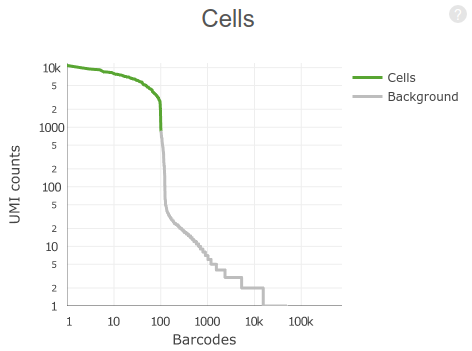
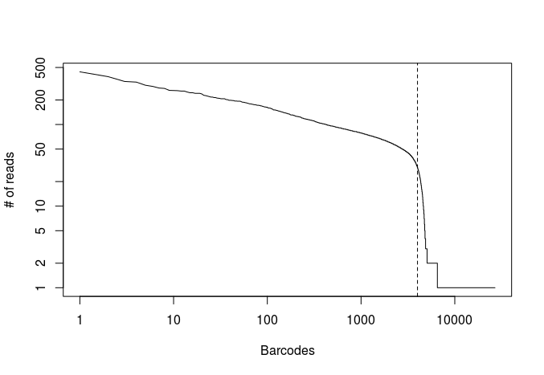

## Overview of Single Cell RNA-seq

*Bulk* RNA-seq captures only an "average" of the expression profiles of thousands of cells. By contrast, *single cell* RNA-seq (scRNA-seq) allows the capture of individual measurements across *thousands* of single cells.

These techniques allow:

- Understanding of cell-to-cell heterogeneity;
- Tracing of differentiation pathways;
- Modelling transcriptional dynamics.

For an overview of scRNA-seq applications see
[Liu, F1000Research (2016)](https://f1000research.com/articles/5-182/v1), [Griffiths *et al.*, molecular systems biology (2018)](https://onlinelibrary.wiley.com/doi/full/10.15252/msb.20178046).

Challenges of scRNA-seq data analysis

- Lower depth than bulk RNA-seq
- High amount of zeros (also called *dropouts*)
- High variability
- High dimensionality

## Chromium System (10x Genomics)

The Chromium System for scRNA-seq, is a droplet based high-throughput system capable of analyzing 100 to 100,000 cells in a single experiment.

Cells are isolated in *gel bead in emulsion droplets* (GEMs) each carrying a single cell along with a single gel bead and reagents needed for reverse transcription of the cell mRNA.

Within each GEM, the cell mRNA is reverse-transcribed such that its cDNA carries a unique *cell barcode*, allowing posterior identification of the originating cell. Each reverse transcribed molecule will also carry a *unique molecule identifier* (UMI) that, along with cell barcode, allows to discriminate between unique mRNA molecules and PCR amplification artifacts.

After reverse-transcription is completed, the resulting cDNA library is obtained by pooling all GEMs and removing the oil from the solution. This library can then be sequenced by standard short-read sequencing (e.g. Illumina).

Sequencing is done in paired end-mode and, unlike in bulk RNA-seq, the number of cycles (number of bases sequenced) is different for the forward and reverse reads: the first read is 26 bp long and contains the *cell barcode* and *UMI*, while the second read is longer (100 bp are recommended) and contains the mRNA sequence, sequenced from the 3' end.


<center>[Chromium Single Cell Gene Expression Solution](https://www.10xgenomics.com/solutions/single-cell/)</center>

## Single Cell Data Analysis

Conceptually, the analysis of a scRNA-seq sample for the purpose of identifying and characterizing cell subpopulations, starts with preprocessing of raw reads, then reads are mapped to a reference genome and quantified in an *UMI count matrix*. Downstream analyses of this count matrix allow the identification and characterization of subpopulations of cells.


<center>[Poirion *et al.* Frontiers in Genetics (2016)](https://www.frontiersin.org/articles/10.3389/fgene.2016.00163/full)</center>

#### 1. Preprocessing

As in bulk RNA-seq, FastQ files preprocessed in order to remove adapter sequences and low quality nucleotides.

*Cell barcodes* and *UMI* sequences are extracted from the first read in order to keep track of cells and unique molecules. Different strategies can be used to account for sequencing errors, such as collapsing *barcodes* or *UMIs* that only differ by a singe nucleotide.

#### 2. Mapping and quantification

Reads are mapped to a reference genome or transcriptome. Here, only the second read is used for mapping (in single-end mode), as the first read does not contain the mRNA sequence, only the *cell barcode* and *UMI* of the original molecule.

In order to contruct a *UMI* count matrix, reads mapping to each gene are counted, and then split by *cell barcode*. In order to account for PCR amplification bias, reads containing the same *cell barcode* **and** *UMI* are collapsed (i.e. they are counted only once).

#### 3. Quality check and filtering (*feature selection*)

Many GEMs...

Low quality cells and outliers are removed from the *UMI* count matrix. These include dead cells, or empty GEMs that contain only ambient RNA.

#### 4. Normalization

The *UMI* matrix is normalized to the total *UMI* count per cell (similarly to reads per million normalization in bulk RNA-seq). Confounding factors such as the total *UMI* count per cell or the relative amount of mitochondrial RNA may also be regressed out.

#### 5. Dimensionality reduction

Because of the high number of cells, it is common to use a dimensionality reduction technique both to visualize the dataset and reduce the dataset to a more manageable size that facilitates clustering analysis.

The most commonly used techniques are Principal Component Analysis (PCA), Independent Component Analysis (ICA) and t-distributed Stochastic Neighbor Embedding (t-SNE).

#### 6. Clustering of cell sub-populations

In order to identify cell subpopulations, clustering may be applied either to the UMI count matrix or a reduced dataset (such as a PCA). The latter is commonly used for datasets with a large number of cells.

Commonly used clustering algorithms include either distance-based methods (such as k-means or hierarchical clustering), or graph-based methods such as PhenoGraph.

#### 7. Differential expression

To identify marker genes for a subpopulation of cells, differential expression (between cells belonging to a cluster and all other cells) may be tested using either naive approaches like t-test or wilcoxon rank-sum test, methods developed for *bulk* RNA-seq such as edgeR or DESeq2, or methods designed specifically for scRNA-seq (SCDE, monocle, ...).


<center>
Bias, robustness and scalability in single-cell differential expression analysis. [Soneson and Robinson, Nature Methods (2018)](https://www.nature.com/articles/nmeth.4612)
</center>

---

In this tutorial, we will go through the basic steps of a *single sample* single-cell analysis.

1. Perform quality control of raw data.
2. Obtain a *UMI* count matrix with `cellranger`.
3. Perform downstream analyses.
   - Filter barcodes and genes.
   - Normalize the raw UMI counts.
   - Perform dimensionality reduction (PCA, t-SNE).
   - Cluster cell subpopulations.
   - Perform differential gene expression to determine subpopulation marker genes.

### Example dataset

We will use an example dataset from 10x.

> **4k PBMCs from a Healthy Donor**

> Peripheral blood mononuclear cells (PBMCs) from a healthy donor (same donor as pbmc8k). PBMCs are primary cells with relatively small amounts of RNA (~1pg RNA/cell).

> - 4,340 cells detected
> - Sequenced on Illumina Hiseq4000 with approximately 87,000 reads per cell
> - 26bp read1 (16bp Chromium barcode and 10bp UMI), 98bp read2 (transcript), and 8bp I7 sample barcode

This dataset was prepared using Chromium Single Cell 3' v2 chemistry (https://support.10xgenomics.com/single-cell-gene-expression/index/doc/specifications-sequencing-requirements-for-single-cell-3) and sequenced on a Illumina Hiseq4000. It can be found here: [pbmc4k](https://support.10xgenomics.com/single-cell-gene-expression/datasets/2.1.0/hgmm_100). *Note: you don't need to download it now.*


We will also need a reference genome. Genomes for human and mouse can be found here: https://support.10xgenomics.com/single-cell-gene-expression/software/downloads/latest.

```
cd reference
wget http://cf.10xgenomics.com/supp/cell-exp/refdata-cellranger-GRCh38-1.2.0.tar.gz
tar xzvf refdata-cellranger-GRCh38-1.2.0.tar.gz
```

### Evaluate sample quality

**Task:** Run FastQC on a pair of scRNA-seq FastQ files. After it completes, open both html reports.

```
fastqc fastqs/hgmm_100_S1_L001_R1_001.fastq.gz fastqs/hgmm_100_S1_L001_R2_001.fastq.gz
```

**Question:** What are the read sizes for the first and second read pairs? Which of the files has better quality scores?
<details><summary>Click Here to see the answer</summary><p>
The forward reads are 26 bp long, and the reverse reads are 98 bp. The reverse read has lower quality scores.

In a 10x dataset, the first (forward) read only contains the cell barcode and UMI, while the RNA sequence (from the 3' end) is on the second (reverse) read. In paired-end sequencing the second read usually has lower quality scores that the first (forward) read.
</p></details><br/>

### LO XX: Use `cellranger` to obtain an UMI count matrix

*Note: In these task we will use a small subset the full dataset consisting of 1M reads, and a genome reference of just human chromosome 1, since the full dataset takes ~14 hours to process using 8 cores and 32Gb of RAM.*

**Task**: Run the commands below to obtain UMI count matrices and a summary report using `cellranger count`.

First, make sure your working directory is `count_pratical`.

```
cd count_pratical
```

`cellranger` must be in the system PATH and the initialization script must be sourced. This will be required for any analysis.

```
export PATH=software/cellranger-2.1.1:$PATH
source sourceme.bash
```

Run `cellranger count` specifying the output folder id (--id), the transcriptome reference (--transcriptome), the folder containing the fastqs to process (--fastqs) and the name of the sample to process (--sample). It is recommended to also specify the approximate number of cells expected to be contained in the same (--expect-cells). To skip secondary analysis we add --nosecondary to the command.

```
cellranger count --id=output_cellranger --transcriptome=reference/GRCh38_1 --fastqs=fastqs/pbmc4k_sample --sample=pbmc4k_sample --jobmode=local --localcores=8 --localmem=12 --expect-cells=4000 --nosecondary
```

### Understand the output of the `cellranger count` command

Running the above commands will produce the following files in the `output_cellranger/outs` directory:

- *web_summary.html*: the main `cellranger` report displaying mapping and filtering statistics as well as results from the secondary analysis (if requested).
- *metrics_summary.csv*: a table containing the mapping and filtering statistics from the web summary.
- *raw_gene_bc_matrices*: the UMI count matrices containing counts for all genes and 10x barcodes.
- *filtered_gene_bc_matrices*: the filtered UMI count matrices, containing only the barcodes that originate from a single cell.

**Task:** Open the file `output_cellranger/outs/web_summary.html` and inspect the contents of the "Summary" tab. Click on the "?" on the top-right of each section for an explanation of the metrics used.

**Question:** Why is the value of "Q30 Bases in RNA Read" lower that the other "Q30" metrics?
<details><summary>Click Here to see the answer</summary><p>
In a 10x dataset, the first (forward) read contains the cell barcode and UMI, while the RNA sequence is on the second (reverse) read. In paired-end sequencing the second read usually has lower quality scores that the first (forward) read.
</p></details><br/>

**Question:** What is the meaning of "Sequencing Saturation"? What you conclude from 7.7% Sequencing Saturation?
<details><summary>Click Here to see the answer</summary><p>
Here, sequencing saturation refers to the percentage of reads originating from a duplicate UMI (in other words, an mRNA molecule that was sequenced more than 1 time).

A 7.7% sequence saturation indicates that *if we were to sequence just one more read*, there would be a 92.3% chance that that read originated from an mRNA molecule that was not already detected. Thus, with such a low saturation we are missing a large number of mRNAs in the sample and should increasing the sequencing depth.
</p></details><br/>



**Question:** The plot on the top-right of the "Summary" tab (shown above) displays the distribution of total UMI counts per cell barcode. Barcodes are ordered from high to low UMI counts. What can you conclude from this figure?
<details><summary>Click Here to see the answer</summary><p>
The steep drop around the 100th barcode is a good indication that ...
</p></details><br/>

### The UMI count matrix

The most important output of the `cellranger count` command is the *UMI count matrix*.

`cellranger` provides this matrix in two versions: a *raw* matrix, that quantifies the number *UMI* per gene for all valid 10x barcodes (~700,000 barcodes), and a *filtered* matrix that only contains the barcodes of GEM partitions containing at least one cell. Additionally, in multi species analyses, a separate matrix is provided for each species.

Because of the high dimensionality of the UMI count matrix and the high number of *zeros*, `cellranger` outputs these matrices in *sparse matrix format*, that takes much less memory. In this format, instead of storing the full *N x M* matrix, where *N* is the number of genes and *M* the number of barcodes (or cells), we use a *M x 3* matrix, where each row indicates a non-zero value at a given row and column of the original matrix.

Example: the matrix below contains 100 values, of which only 10% are non-zero values.

|       | Cell1| Cell2| Cell3| Cell4| Cell5| Cell6| Cell7| Cell8| Cell9| Cell10|
|:------|-----:|-----:|-----:|-----:|-----:|-----:|-----:|-----:|-----:|------:|
|Gene1  |     0|    39|     0|     0|     0|     0|     0|     0|     0|      0|
|Gene2  |     0|     0|     0|     0|     0|     0|     0|     0|     0|      0|
|Gene3  |     0|     0|     0|    92|     0|     0|     0|     0|     0|      0|
|Gene4  |     0|     0|     0|     0|     0|     0|    54|     0|     0|      0|
|Gene5  |     0|     0|     0|     0|     0|     0|     0|     0|     0|      0|
|Gene6  |     0|     0|     0|     0|     0|     0|     0|     0|    16|      0|
|Gene7  |     0|     0|     0|     0|     0|     0|    95|    81|     0|      0|
|Gene8  |     0|     0|     0|     0|     0|     0|     0|     0|     0|      0|
|Gene9  |     0|     0|     0|     0|     0|     0|     0|     0|     0|      0|
|Gene10 |     0|     0|    41|    21|     0|     0|     0|     0|     0|     16|

Below is the same matrix represented in *sparse matrix* format. Only the non-zero values from the original matrix are stored. Thus, in this format we only have to store 27 values instead of 100.

| row| col| value|
|---:|---:|-----:|
|   1|   2|    39|
|  10|   3|    41|
|   3|   4|    92|
|  10|   4|    21|
|   4|   7|    54|
|   7|   7|    95|
|   7|   8|    81|
|   6|   9|    16|
|  10|  10|    16|


**Task**: On the command line type the folling command:

```
head results/count_hgmm_100_lane1_hg19_mm10/outs/raw_gene_bc_matrices/hg19/matrix.mtx
```

This command will display the first 6 lines from the UMI matrix file. The values in the 3rd line indicate respectively the dimensions of the matrix (number of rows and number of clumns) and the total number of non-zero values in the matrix. Each line following indicates the presence on a non-zero UMI count at specified row and column in the form of a tripet *row*, *column* and *value*. For example, the triplet `11083 2 1` indicates that gene *11083* has a UMI count of *1* for barcode number *2*.

**Question**: How many genes and barcodes are quantified in the above matrix? What is the number of *zeros* in the *N x M* matrix?
<details><summary>Click Here to see the answer</summary><p>
32,738 genes and 737,280 barcodes.

32,738 x 737,280 - 164,246 = 24,136,908,394 zeros (or 99.9993195% of the matrix!)
</p></details><br/>

## LO XX: Use Drop-seq tools to obtain an UMI count matrix

While `cellranger count` is a self-contained pipeline that automates all the steps necessary to obtain the *UMI* count matrix and works well with datasets obtained from the Chromium platform, a number of alternative pipelines exist that allow greater flexibility in the analysis, such as [Drop-seq tools](http://mccarrolllab.com/dropseq/) and [UMI tools]().

**Task**: Run the following commands, one at a time, to obtain the UMI count matrix using the Drop-seq tools pipeline. Take time to inspect and understand the output of each step.

### 1. Preparation and filtering

First, move to the project directory and create a new directory to store the results.

```
cd count_pratical
mkdir output_dropseq
```

Also make the drop-seq tools available on the command line.

```
export PATH=software/Drop-seq_tools-1.13:$PATH
```

#### 1.1 FastqToSam

The first step is to convert our paired-end FastQ files to an unaligned sam/bam format. This will facilitate extraction of the cell barcodes and UMI and their association to the RNA read.

```
picard-tools FastqToSam FASTQ=fastqs/pbmc4k_sample/pbmc4k_sample_S1_L001_R1_001.fastq.gz FASTQ2=fastqs/pbmc4k_sample/pbmc4k_sample_S1_L001_R2_001.fastq.gz QUALITY_FORMAT=Standard SAMPLE_NAME=pbmc4k_sample OUTPUT=output_dropseq/pbmc4k_sample_unaligned.bam
```

The above command will generate a new file called `output/pbmc4k_sample_unaligned.bam` that contains both the first and second reads from the original FastQ files. You can inspect the first lines of this file with the command:

```
samtools view output_dropseq/pbmc4k_sample_unaligned.bam | head
```

#### 1.2 TagBamWithReadSequenceExtended

Next we extract the cell barcode from the first 16 bases of left reads. The barcode will be assiciated to the RNA (right) reads using an extended sam tag that we name *XC* (the C stands for Cell).

```
TagBamWithReadSequenceExtended INPUT=output_dropseq/pbmc4k_sample_unaligned.bam OUTPUT=output_dropseq/pbmc4k_sample_unaligned_cell.bam SUMMARY=output_dropseq/pbmc4k_sample_unaligned_cell.bam_summary.txt BASE_RANGE=1-16 BASE_QUALITY=10 BARCODED_READ=1 DISCARD_READ=False TAG_NAME=XC NUM_BASES_BELOW_QUALITY=1
```

Notice the added *XC* tag that indicates the cell barcode associated with each right read.

```
samtools view output_dropseq/pbmc4k_sample_unaligned_cell.bam | head
```

#### 1.3 TagBamWithReadSequenceExtended

We then repeat the same procedure to extract the molecule identifier (UMI) located in bases 17-26 of the left read.

```
TagBamWithReadSequenceExtended INPUT=output_dropseq/pbmc4k_sample_unaligned_cell.bam OUTPUT=output_dropseq/pbmc4k_sample_unaligned_cell_umi.bam SUMMARY=output_dropseq/pbmc4k_sample_unaligned_cell_umi.bam_summary.txt BASE_RANGE=17-26 BASE_QUALITY=10 BARCODED_READ=1 DISCARD_READ=True TAG_NAME=XM NUM_BASES_BELOW_QUALITY=1
```

Notice the added *XM* tag in the right reads. At this point we also discard all left reads, since we don't need any more information from them.

```
samtools view output_dropseq/pbmc4k_sample_unaligned_cell_umi.bam | head
```

#### 1.4 FilterBAM

In the previous steps, an additional *XM* tag was also added to reads that have at least one bad quality base in the barcode or UMI sequence. Here we filter the bam file by removing these low-confidence reads.

```
FilterBAM TAG_REJECT=XQ INPUT=output_dropseq/pbmc4k_sample_unaligned_cell_umi.bam OUTPUT=output_dropseq/pbmc4k_sample_unaligned_filtered.bam
```

#### 1.5 Trim polyA

Some scRNA-seq protocols, such as the Chromium System, sequence only the 3' ends of captured mRNA molecules. Thus, it is common for this sequence to contain part of the poly-A tail of the mRNas. Here trim the reads in order to remove poly-A tails.

```
PolyATrimmer INPUT=output_dropseq/pbmc4k_sample_unaligned_filtered.bam OUTPUT=output_dropseq/pbmc4k_sample_unaligned_filtered_trimmed.bam OUTPUT_SUMMARY=output_dropseq/pbmc4k_sample_unaligned_filtered_trimmed.bam_summary.txt MISMATCHES=0 NUM_BASES=6
```

#### 1.6. SamToFastq

Finally, after the preprocessing steps are completed, we can convert the sam/bam back to FastQ format in order to proceed with the analysis.

```
picard-tools SamToFastq INPUT=output_dropseq/pbmc4k_sample_unaligned_filtered_trimmed.bam FASTQ=output_dropseq/pbmc4k_sample_unaligned_filtered_trimmed.fastq
```

It is good practice to generate a FastQC report at this point, in order to evaluate the impact of these preprocessing steps on the sample.

```
fastqc output_dropseq/pbmc4k_sample_unaligned_filtered_trimmed.fastq
```

### 2. Alignment

At this point we have generated **two** important files that are essential to proceed with the analysis:

- `output_dropseq/pbmc4k_sample_unaligned_filtered_trimmed.fastq`: this contains just the mRNA sequences in standard FastQ format and can be used for mapping.
- `output_dropseq/pbmc4k_sample_unaligned_filtered_trimmed.bam`: this contains both the mRNA sequences as well as the associated cell barcode and unique molecule idenfier for each read.

#### 2.1 STAR

We are now ready to map the reads to a reference genome or transcriptome. Here we use the [STAR](https://github.com/alexdobin/STAR) aligner to map the reads to human chromosome 1. We use the same reference files used for `cellranger`.

```
mkdir -p output_dropseq/STAR
STAR --runThreadN 8 --genomeDir ../reference/GRCh38_1/star --readFilesIn output_dropseq/pbmc4k_sample_unaligned_filtered_trimmed.fastq --outFileNamePrefix output_dropseq/STAR/star --outSAMtype BAM SortedByCoordinate
```

A summary of the mapping procedure is provided.

```
cat output_dropseq/STAR/starLog.final.out
```

#### 2.3 MergeBamAlignment

Now the file `starAligned.sortedByCoord.out.bam` contains the aligned reads. However, in the process we lost the information about the cell barcodes and UMI. We can still recover this information from the unaligned bam file we generated previously. In the following commands we merge the information from the unaligned bam file with the newly generated alignments.

```
picard-tools SortSam I=output_dropseq/STAR/starAligned.sortedByCoord.out.bam O=output_dropseq/STAR/starAligned.sortedByQueryname.bam SORT_ORDER=queryname
picard-tools CreateSequenceDictionary REFERENCE=../reference/GRCh38_1/fasta/genome.fa OUTPUT=../reference/GRCh38_1/fasta/genome.dict
picard-tools MergeBamAlignment REFERENCE_SEQUENCE=../reference/GRCh38_1/fasta/genome.fa UNMAPPED_BAM=output_dropseq/pbmc4k_sample_unaligned_filtered_trimmed.bam ALIGNED_BAM=output_dropseq/STAR/starAligned.sortedByQueryname.bam OUTPUT=output_dropseq/starAligned.merged.bam INCLUDE_SECONDARY_ALIGNMENTS=false PAIRED_RUN=false
```

Notice we have now recovered and associated the cell barcodes and UMI to each aligned read through the *XC* and *XM* tags.

```
samtools view output_dropseq/starAligned.merged.bam | head
```

#### 2.4 BAMTagHistogram (optional)

The following command can be used to generate a histogram of absolute number of reads per cell barcode.

```
BAMTagHistogram I=output_dropseq/starAligned.merged.bam O=output_dropseq/read_counts.txt TAG=XC
```

In **RStudio** set your working directory to the dropseq project directory, and run the following commands to generate the plot below.

```R
read.counts <- read.table("output_dropseq/read_counts.txt")
plot(tab[,1], type="l", log="xy", xlab="Barcodes", ylab="# of reads")
abline(v=4000, lty="dashed")
```


As expected, we notice a sharp drop after around 4,000 barcodes.

### 3. Counting

We are now ready to proceed to the UMI counting step. If we wanted to quantify raw reads per gene, we could now simply use a program like `featureCounts` or `htseq-count`. However, because we want to count unique *UMIs* we need to perform the calculation in two steps: 1. first we tag each read with the gene it overlaps (if any), and 2. we count unique UMIs for each gene.

#### 3.1 TagReadWithGeneExon

We add a bam tag to each mapped read indicating if that read is overlapping any annotated exon.

```
TagReadWithGeneExon I=output_dropseq/starAligned.merged.bam O=output_dropseq/starAligned.merged.exons.bam ANNOTATIONS_FILE=../reference/GRCh38_1/genes/genes.gtf TAG=GE
```

Reads overlapping exons will be tagged with a *GE* tag:

```
samtools view output_dropseq/starAligned.merged.exons.bam | grep "GE:" | head
```

### 3.2 DigitalExpression

Finally we count how many unique UMIs are associated with each gene and cell barcode. In the `DigitalExpression` command we indicate the names of the tags we used for cell barcodes, UMIs and exons. We also indicate how many barcodes/cells we wish to report in the UMI matrix (in this case 4000 cells).

```
DigitalExpression I=output_dropseq/starAligned.merged.exons.bam O=output_dropseq/pbmc4k_sample.dge.txt.gz SUMMARY=output_dropseq/pbmc4k_sample.dge.summary.txt CELL_BARCODE_TAG=XC MOLECULAR_BARCODE_TAG=XM GENE_EXON_TAG=GE NUM_CORE_BARCODES=4000
```

This command will generate an UMI count matrix (in standard tabular format). Because this matrix file can be quite big, it is compressed with `gzip`.

## Comparison of both methods

**Task**: In **RStudio** set the working directory to `count_practical` and run the commands below.

Load the `Matrix` package to work with `cellranger` sparse matrices.

```R
library(Matrix)
```

Import the Drop-seq UMI count matrix.

```R
mat_ds <- read.table(gzfile("output_dropseq/pbmc4k_sample.dge.txt.gz"), header=TRUE)
rownames(mat_ds) <- make.unique(as.character(mat_ds$GENE))
mat_ds[, 1] <- NULL
mat_ds <- Matrix(as.matrix(mat_ds))
```

Import the `cellranger` UMI count matrix.

```R
mat_cr <- readMM(file = "output_cellranger/outs/filtered_gene_bc_matrices/GRCh38_1/matrix.mtx")
genes <- read.table("output_cellranger/outs/filtered_gene_bc_matrices/GRCh38_1/genes.tsv")
barcodes <- read.table("output_cellranger/outs/filtered_gene_bc_matrices/GRCh38_1/barcodes.tsv")
rownames(mat_cr) <- make.unique(as.character(genes[, 2]))
colnames(mat_cr) <- barcodes[, 1]
```

Make a plot of the total UMI counts for genes appearing in both matrices.

```R
common.genes <- intersect(rownames(mat_ds), rownames(mat_cr))
total_ds <- rowSums(mat_ds)[ common.genes ]
total_cr <- rowSums(mat_cr)[ common.genes ]

plot(total_ds, total_cr, log="xy", pch=20, xlab="UMI counts (Drop-seq tools)", ylab="UMI counts (CellRanger)")
abline(0, 1, lty="dashed", col="grey")
```


## List of R practical exercises

### Quality control and downstream analysis of pbmc4k using Seurat

- Filtering
- Normalization
- Dimensionality reduction with PCA
- Clustering
- Visualization with t-SNE
- Identification of marker genes (differential expression)

### Quality control and downstream analysis of pbmc4k using scater and s3c

- Quality control
- Normalization
- Dimensionality reduction with PCA
- Clustering
- Visualization with t-SNE
- Identification of marker genes (differential expression)

### Multiplet estimation using mixed species dataset

- Import and join the two matrices
- Compare counts for both species
- Estimate multiplet rate
